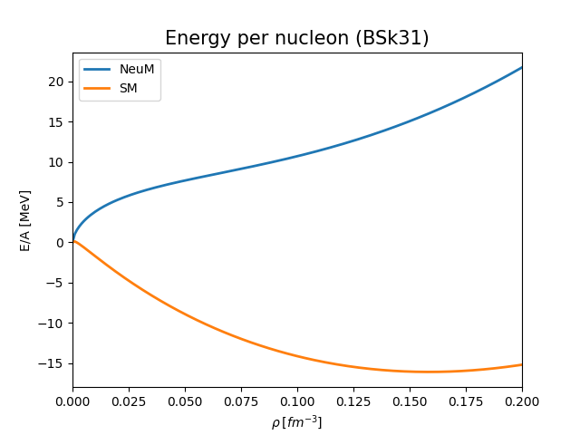

Physics
=======

:math:`E=mc^2`

*******************
Pure neutron matter
*******************
Neutron stars are built from pure neutron matter - this is very good approximation.

****************
Symmetric matter
****************
Atomic nuclei (especially those of lower mass) have similar number protons and neutrons.
Therefore, it's convenient to consider symmetric matter. We know that
for larger number of nucleons, the system tends to be more neutron-rich
to remove Coulomb interaction. In contrast to pure neutron matter, there is no
symmetric nuclear matter in the nature. However this concept is very useful
for theoretical considerations.

******
Energy
******
.. image:: _static/energySM.png
  :width: 48 %

*****
Crust
*****
In the crust we can show certain densities that are relevant. The major division
is to **outer crust** and **inner crust**.

Pairing S
---------

Pairing P
---------

Pasta phase
-----------
